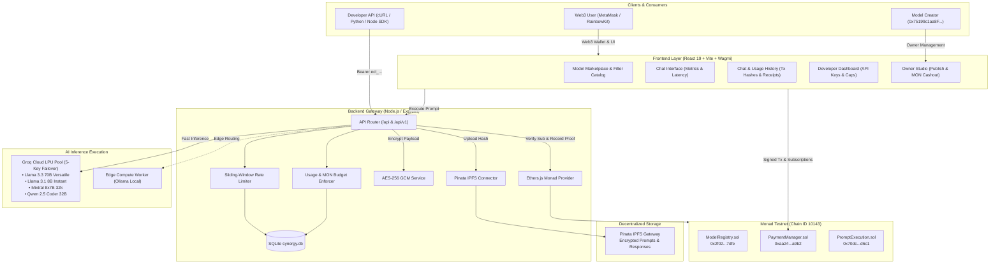
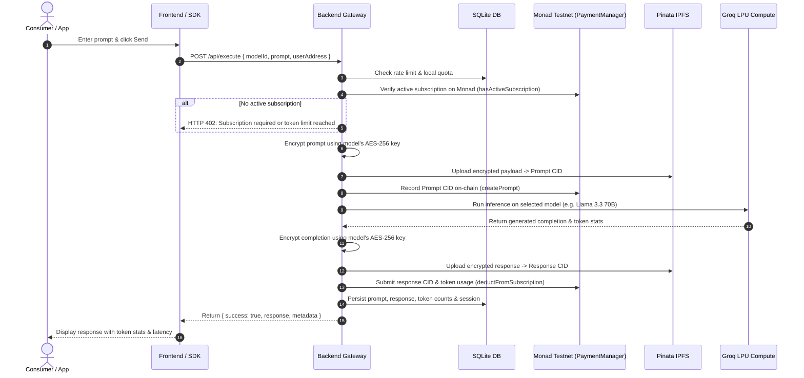
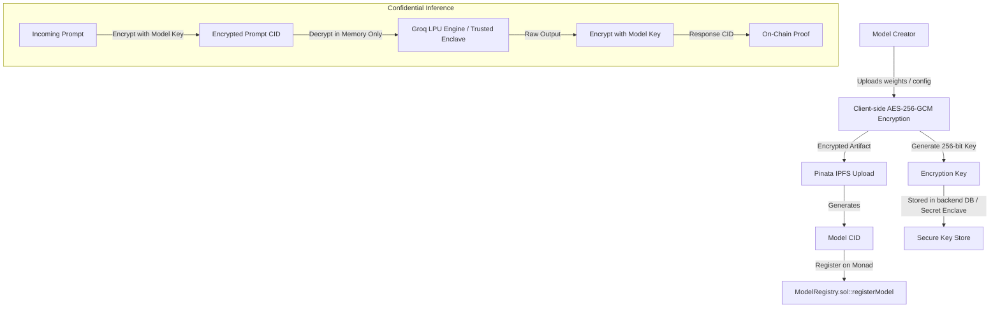
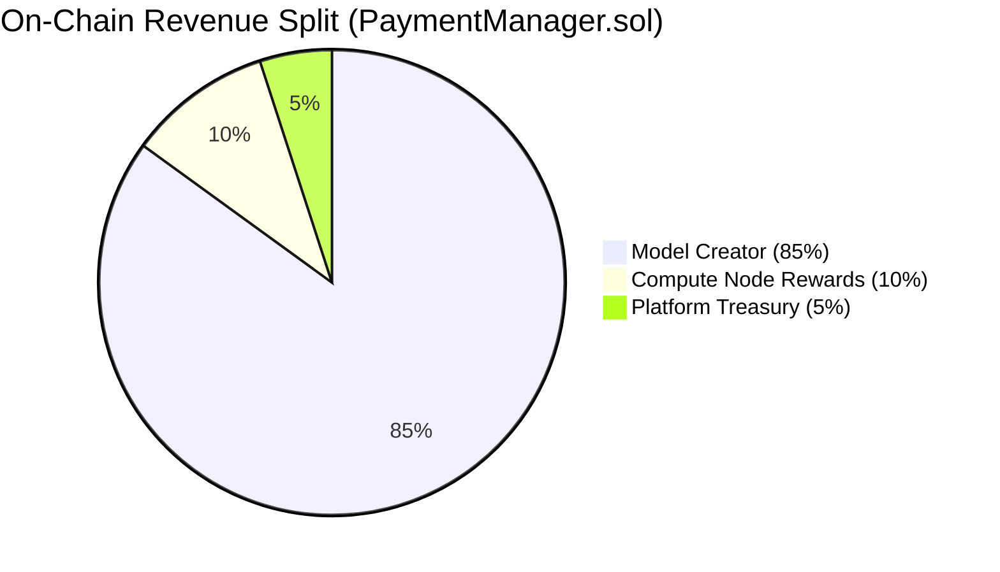
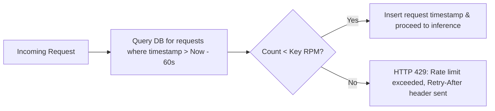

# 🏛️ ECLIPSE.AI Technical Architecture

ECLIPSE.AI is a decentralized, high-throughput AI model marketplace and execution network deployed on the **Monad Testnet** (Chain ID: `10143`). This document details the end-to-end system architecture, protocol specifications, data flow, encryption lifecycles, and on-chain economics.

---

## 📑 Table of Contents

- [1. System Topology](#1-system-topology)
- [2. Component Breakdown](#2-component-breakdown)
  - [2.1 Frontend Presentation Layer](#21-frontend-presentation-layer)
  - [2.2 Backend Gateway & Orchestrator](#22-backend-gateway--orchestrator)
  - [2.3 Compute & Inference Layer](#23-compute--inference-layer)
  - [2.4 Monad Blockchain Layer](#24-monad-blockchain-layer)
  - [2.5 Decentralized Storage (IPFS)](#25-decentralized-storage-ipfs)
- [3. End-to-End Execution Sequence](#3-end-to-end-execution-sequence)
- [4. Model Publishing & Encryption Lifecycle](#4-model-publishing--encryption-lifecycle)
- [5. Token Economics & Revenue Sharing](#5-token-economics--revenue-sharing)
- [6. Sliding-Window Rate Limiter](#6-sliding-window-rate-limiter)
- [7. On-Chain Contracts Specification](#7-on-chain-contracts-specification)

---

## 1. System Topology

---

## 2. Component Breakdown

### 2.1 Frontend Presentation Layer
- **Framework**: React 19 bootstrapped with Vite.
- **Web3 Stack**: Wagmi v2, Viem, and RainbowKit configured for Monad Testnet (`10143`).
- **Styling**: Cyberpunk dark glassmorphism theme using Vanilla CSS variables and hardware-accelerated Framer Motion animations.
- **Key Modules**:
  - `Marketplace.jsx`: Grid catalog displaying single-digit MON subscription prices, active nodes, context sizes, and model latency.
  - `ModelDetail.jsx`: Real-time chat workspace displaying token consumption (`📥 in`, `📤 out`), execution latency (`⏱️`), and instant response streaming.
  - `ChatHistory.jsx`: Complete audit trail containing past chat sessions, purchase history with Monad Explorer receipts, and prompt token usage records.
  - `Dashboard.jsx`: Self-service developer hub for creating scoped `ecl_...` API keys with sliding-window RPM limits and MON budget caps.
  - `OwnerDashboard.jsx`: Model creator management portal with on-chain revenue tracking and 100% native MON cashout.

### 2.2 Backend Gateway & Orchestrator
- **Runtime**: Node.js v18+ with Express framework.
- **Database**: SQLite (`synergy.db`) managed via `better-sqlite3` for sub-millisecond local querying.
- **Responsibilities**:
  - Authenticating Web3 signatures and developer API tokens.
  - Orchestrating the prompt execution pipeline (rate check -> on-chain check -> encryption -> IPFS -> compute -> response encryption -> ledger commit).
  - Monitoring compute node health and managing multi-key Groq LPU failovers.

### 2.3 Compute & Inference Layer
- **Groq Cloud LPU Pool**: Ultra-low latency Language Processing Unit (LPU) cloud infrastructure running at 500+ tokens/second.
- **Key Rotation**: Dynamic pool of 5 Groq API keys with round-robin dispatch and automatic retry on HTTP 429 (rate-limited) responses.
- **Edge Compute Worker**: Decentralized node worker written in Node.js that listens to the network, executes inference locally via Ollama, and commits proofs on-chain.

### 2.4 Monad Blockchain Layer
- **Consensus**: Monad BFT with parallelized EVM execution delivering 10,000 TPS and 1-second block times.
- **Native Currency**: `MON` used directly for transactions without requiring cumbersome ERC-20 token approvals (`approve()` + `transferFrom()`).
- **Core Smart Contracts**:
  1. `ModelRegistry.sol`: Decentralized registry of models, IPFS CIDs, and subscription prices.
  2. `PaymentManager.sol`: Native MON payments with automatic 85/10/5 revenue splits and creator cashout logic.
  3. `PromptExecution.sol`: Verifiable prompt and response ledger storing cryptographic hashes.

### 2.5 Decentralized Storage (IPFS)
- **Pinata IPFS Gateway**: Cryptographically secures all prompt inputs and model outputs off-chain.
- Payloads are encrypted with model-specific AES-256-GCM symmetric keys prior to upload, ensuring zero plain-text leaks to IPFS nodes.

---

## 3. End-to-End Execution Sequence

The sequence diagram below details what happens when a user submits a prompt to an AI model on ECLIPSE.AI:

---

## 4. Model Publishing & Encryption Lifecycle

To protect proprietary models and prompt confidentiality, ECLIPSE.AI enforces an end-to-end cryptographic pipeline:

---

## 5. Token Economics & Revenue Sharing

All platform fees, subscriptions, and pay-per-use payments are denominated in native Monad testnet tokens (**`MON`**). The smart contract enforces an immutable 85/10/5 split on every transaction:

- **Model Creator (85%)**: 
  - Immediately available for withdrawal in native `MON` via the Owner Dashboard or directly through `PaymentManager.sol::cashoutOwnerEarnings()`.
- **Compute Nodes (10%)**: 
  - Credited to the `nodeRewards[computeNode]` mapping on-chain. Node operators claim their earnings via `claimNodeRewards()`.
- **Platform Treasury (5%)**: 
  - Retained in the contract for network gas subsidies, continuous development, and infrastructure.

---

## 6. Sliding-Window Rate Limiter

Developer API keys utilize a high-precision sliding-window rate limiting algorithm implemented in SQLite:

$$\text{Active Requests} = \sum_{\tau = t - 60000}^{t} \text{request}(\tau)$$

This guarantees zero burst vulnerability and protects downstream Groq LPU compute quotas.

---

## 7. On-Chain Contracts Specification

Deployed on **Monad Testnet (Chain ID `10143`)**:

| Contract | Address | Purpose |
|:---|:---|:---|
| **`ModelRegistry`** | [`0x2f02861ff42c0d04823dadd08326de0b07f57dfe`](https://testnet.monadexplorer.com/address/0x2f02861ff42c0d04823dadd08326de0b07f57dfe) | Immutable model catalog mapping model IDs to owner addresses, pricing, and IPFS CIDs. |
| **`PaymentManager`** | [`0xaa2499494b61d293a437c6bd31ca22b88d8aa9b2`](https://testnet.monadexplorer.com/address/0xaa2499494b61d293a437c6bd31ca22b88d8aa9b2) | Native MON payment router for 85/10/5 revenue splits, subscriptions, and owner cashouts. |
| **`PromptExecution`**| [`0x70dcf4d82c8e1b989d2a7a3c2303fa48a348d6c1`](https://testnet.monadexplorer.com/address/0x70dcf4d82c8e1b989d2a7a3c2303fa48a348d6c1) | Execution verification ledger recording prompt CIDs, response CIDs, and token usage. |

---

*For deployment instructions, see [DEPLOYMENT.md](DEPLOYMENT.md). For developer API reference, see [API.md](API.md).*
