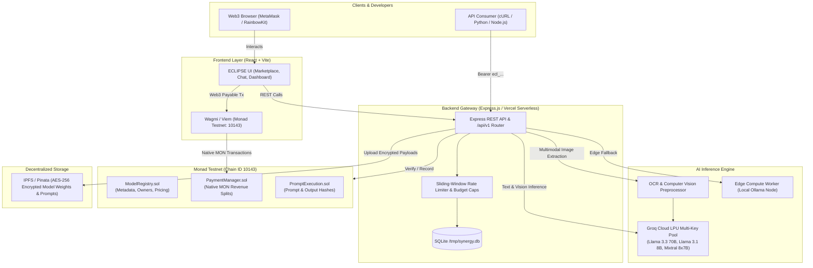
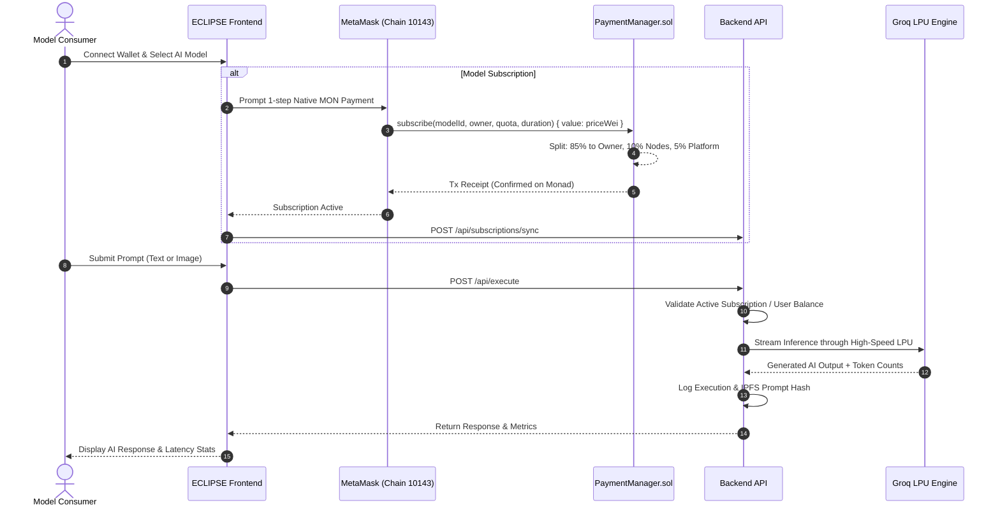
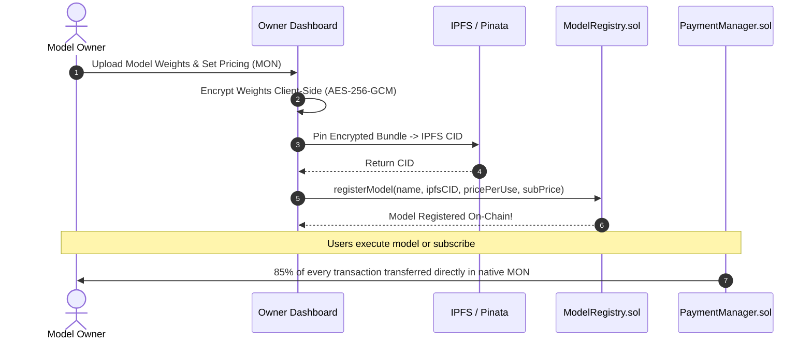
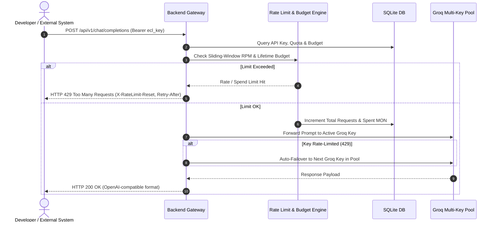

# 🌌 ECLIPSE.AI — Decentralized AI Model Marketplace on Monad

[-836ef9?style=for-the-badge&logo=ethereum)](https://testnet.monadexplorer.com)
[](https://soliditylang.org/)
[](https://groq.com/)
[](https://vitejs.dev/)
[](https://opensource.org/licenses/MIT)

**ECLIPSE.AI** is a decentralized, high-throughput marketplace for AI models deployed on the **Monad Testnet** (10,000 TPS, 1-second finality). It enables AI creators to monetize models trustlessly with AES-256 IPFS encryption, automatic on-chain revenue sharing in native Monad testnet tokens (**MON**), and sub-second inference powered by a resilient multi-key **Groq Cloud LPU** pool.

---

## 📑 Table of Contents

- [Architectural Overview](#-architectural-overview)
- [System Architecture Flow](#-system-architecture-flow)
- [User Workflows](#-user-workflows)
  - [1. Model Consumer Journey](#1-model-consumer-journey)
  - [2. Model Owner & Monetization Journey](#2-model-owner--monetization-journey)
  - [3. Developer API & Rate-Limited Access](#3-developer-api--rate-limited-access)
- [Monorepo Directory Structure](#-monorepo-directory-structure)
- [Sub-Module Documentation](#-sub-module-documentation)
- [Quick Start Guide](#-quick-start-guide)
  - [Prerequisites](#prerequisites)
  - [1. Clone & Configure Environment](#1-clone--configure-environment)
  - [2. Start the Backend Engine](#2-start-the-backend-engine)
  - [3. Launch the Frontend UI](#3-launch-the-frontend-ui)
  - [4. Deploy Smart Contracts to Monad Testnet](#4-deploy-smart-contracts-to-monad-testnet)
- [Smart Contracts & On-Chain Revenue Model](#-smart-contracts--on-chain-revenue-model)
- [Vercel Deployment Guide](#-vercel-deployment-guide)
- [Security & Verification](#-security--verification)
- [License](#-license)

---

## 🏗️ Architectural Overview



---

## 🔄 System Architecture Flow

### 1. Model Consumer Journey



---

### 2. Model Owner & Monetization Journey



---

### 3. Developer API & Rate-Limited Access



---

## 📁 Monorepo Directory Structure

```plaintext
monadhacks/
├── api/                     # Vercel serverless entry point
│   └── index.js             # Serverless bridge exporting the Express app
├── backend/                 # Node.js Express Backend API
│   ├── src/
│   │   ├── abis/            # Contract ABI artifacts (PaymentManager, ModelRegistry, PromptExecution)
│   │   ├── db/              # SQLite database (sqlite.js, schema, auto-migration)
│   │   ├── routes/          # Express route controllers:
│   │   │   ├── apikeys.js   # API key generation, budget & RPM management
│   │   │   ├── execution.js # Interactive inference controller
│   │   │   ├── history.js   # Chat history persistence
│   │   │   ├── inference.js # OpenAI-compatible /v1/chat/completions endpoint
│   │   │   ├── models.js    # Model catalog & metadata
│   │   │   ├── payments.js  # Earnings withdrawal & cashout handlers
│   │   │   └── subscriptions.js # On-chain subscription indexer
│   │   ├── services/        # Core business services:
│   │   │   ├── blockchain.js# Monad RPC provider & contract interfaces
│   │   │   ├── compute.js   # Groq multi-key pool & local Ollama failover
│   │   │   ├── encryption.js# AES-256 payload encryption utilities
│   │   │   └── ipfs.js      # Pinata IPFS upload & gateway service
│   │   └── server.js        # Server bootstrap & middleware setup
│   ├── package.json
│   └── README.md            # 📖 Backend Sub-Module Guide
├── frontend/                # React 19 + Vite Web Application
│   ├── src/
│   │   ├── components/      # UI components (Navbar, FaucetModal, CashoutModal, WebGLShader)
│   │   ├── pages/           # Application views:
│   │   │   ├── Landing.jsx       # Hero landing page with interactive WebGL shader
│   │   │   ├── Marketplace.jsx   # AI model discovery catalog
│   │   │   ├── ModelDetail.jsx   # Interactive inference chat & on-chain subscription
│   │   │   ├── Dashboard.jsx     # Developer API keys, usage metrics & faucet
│   │   │   ├── OwnerDashboard.jsx# Model owner earnings & analytics
│   │   │   ├── UploadModel.jsx   # Encrypted model publishing studio
│   │   │   └── RoleSelect.jsx    # Persona selection (Consumer vs Creator)
│   │   ├── App.jsx          # Root component & global state context
│   │   └── main.jsx         # Wagmi, RainbowKit & Monad Testnet config
│   ├── package.json
│   └── README.md            # 📖 Frontend Sub-Module Guide
├── src/                     # Foundry Solidity Smart Contracts
│   ├── ModelRegistry.sol    # On-chain model catalog registry
│   ├── PaymentManager.sol   # Native MON payable revenue router (85/10/5)
│   ├── PromptExecution.sol  # On-chain prompt and execution hash records
│   └── README.md            # 📖 Smart Contracts Sub-Module Guide
├── script/                  # Foundry Deployment Scripts
│   └── Deploy.s.sol         # Monad Testnet automated broadcast script
├── compute-node/            # Decentralized Compute Node Worker
│   ├── worker.js            # Node worker script for local edge processing
│   ├── package.json
│   └── README.md            # 📖 Compute Node Sub-Module Guide
├── foundry.toml             # Foundry configuration (Monad Testnet RPC: 10143)
├── vercel.json              # Root fullstack Vercel deployment manifest
├── package.json             # Root monorepo build & orchestrator scripts
└── README.md                # Main repository documentation
```

---

## 📚 Sub-Module Documentation

For deep-dive documentation into each component of the ecosystem, refer to the dedicated sub-READMEs:

| Module | Purpose | Link |
|--------|---------|------|
| **Frontend** | React UI, WebGL shader, Wagmi & MetaMask wallet integration, live inference chat | [Frontend Guide](file:///Users/arpitdoshi/monadhacks/frontend/README.md) |
| **Backend** | Express API, Groq LPU pool, rate limiting, budget caps, OpenAI-compatible endpoint | [Backend Guide](file:///Users/arpitdoshi/monadhacks/backend/README.md) |
| **Smart Contracts** | Foundry Solidity contracts, native MON revenue splits, deployment scripts | [Contracts Guide](file:///Users/arpitdoshi/monadhacks/src/README.md) |
| **Compute Node** | Decentralized compute worker, edge inference, reward claims | [Compute Node Guide](file:///Users/arpitdoshi/monadhacks/compute-node/README.md) |

---

## 🚀 Quick Start Guide

### Prerequisites

- **Node.js**: v18.0.0 or higher ([Download](https://nodejs.org/))
- **Foundry**: For smart contract compilation and deployment ([Install Foundry](https://getfoundry.sh/))
- **Web3 Wallet**: [MetaMask](https://metamask.io/) or Rainbow Wallet configured with **Monad Testnet**

---

### 1. Clone & Configure Environment

```bash
# Clone the repository
git clone https://github.com/Arpit-R-Doshi/monadhacks.git
cd monadhacks

# Copy environment template
cp .env.example .env
```

Edit `.env` to configure your keys:
```env
# Blockchain (Monad Testnet)
DEPLOYER_PRIVATE_KEY=your_private_key_here
MONAD_TESTNET_RPC=https://testnet-rpc.monad.xyz/
MONAD_CHAIN_ID=10143

# Contract Addresses (filled after deploying contracts)
MODEL_REGISTRY_ADDRESS=
PAYMENT_MANAGER_ADDRESS=
PROMPT_EXECUTION_ADDRESS=

# AI Cloud Inference (Groq Multi-Key Pool)
GROQ_API_KEY=gsk_...
GROQ_API_KEY_1=gsk_...
GROQ_API_KEY_2=gsk_...

# Server
PORT=3001
FRONTEND_URL=http://localhost:5173
```

---

### 2. Start the Backend Engine

```bash
cd backend
npm install
npm run dev
```
* The backend will start on **`http://localhost:3001`**.
* Health Check: `curl http://localhost:3001/api/health`
* Seed Models: `curl http://localhost:3001/api/seed`

---

### 3. Launch the Frontend UI

```bash
cd ../frontend
npm install
npm run dev
```
* The frontend will be available at **`http://localhost:5173`**.
* Connect your MetaMask wallet and claim testnet tokens from the built-in **Faucet Modal**.

---

### 4. Deploy Smart Contracts to Monad Testnet

Ensure your deployer address has testnet MON from the [Official Monad Faucet](https://testnet.monad.xyz/):

```bash
# From root directory:
forge build

# Deploy to Monad Testnet:
forge script script/Deploy.s.sol --rpc-url https://testnet-rpc.monad.xyz/ --broadcast --private-key $DEPLOYER_PRIVATE_KEY
```

Once deployed, copy the printed contract addresses (`ModelRegistry`, `PaymentManager`, `PromptExecution`) into your `.env` file!

---

## 🔐 Smart Contracts & On-Chain Revenue Model

All payments, subscriptions, and payouts are conducted **exclusively in native Monad testnet tokens (`MON`)**.

| Contract | Functionality | Revenue Split / Mechanism |
|----------|---------------|---------------------------|
| **`PaymentManager.sol`** | Native `payable` router for inference & subscriptions | **85%** directly to Model Owner<br>**10%** to Compute Node Workers<br>**5%** to Platform Treasury |
| **`ModelRegistry.sol`** | Immutable model registry | Stores encrypted model IPFS CIDs, ownership proof, and pricing metadata |
| **`PromptExecution.sol`** | Cryptographic verification | Tracks prompt lifecycle hashes on-chain for tamper-proof audit trails |

### Native MON Subscription Flow (No Approval Required)

Unlike traditional ERC-20 tokens that require a separate `approve()` transaction, users subscribe with a single on-chain transaction:

```solidity
// Direct native payable subscription in PaymentManager.sol
function subscribe(
    string calldata _modelId,
    address _modelOwner,
    uint256 _quota,
    uint256 _duration
) external payable {
    require(msg.value > 0, "Price must be > 0");
    uint256 ownerAmount = (msg.value * MODEL_OWNER_SHARE) / 10000;
    uint256 platformAmount = msg.value - ownerAmount;

    (bool sentOwner, ) = payable(_modelOwner).call{value: ownerAmount}("");
    require(sentOwner, "Failed to send MON to model owner");
    ...
}
```

---

## ☁️ Vercel Deployment Guide

ECLIPSE.AI is configured for instantaneous deployment on **Vercel** with fullstack monorepo support:

1. Import the repository into your [Vercel Dashboard](https://vercel.com).
2. Set the **Framework Preset** to `Vite`.
3. Add environment variables in the Vercel Project Settings:
   - `GROQ_API_KEY`, `GROQ_API_KEY_1`, `GROQ_API_KEY_2`, etc.
   - `MONAD_TESTNET_RPC=https://testnet-rpc.monad.xyz/`
   - `MONAD_CHAIN_ID=10143`
   - `DEPLOYER_PRIVATE_KEY=...`
   - `MODEL_REGISTRY_ADDRESS`, `PAYMENT_MANAGER_ADDRESS`, `PROMPT_EXECUTION_ADDRESS`
4. Click **Deploy**. Vercel automatically builds `frontend/dist` and mounts serverless routes via `/api/index.js`.

---

## 🛡️ Security & Verification

- **End-to-End Encryption**: Models and prompts are encrypted client-side using **AES-256-GCM** before being pinned to IPFS.
- **Audited Smart Contracts**: Contracts inherit OpenZeppelin's standard `Ownable` and `ReentrancyGuard` patterns.
- **Key Safety**: Private keys are strictly ignored by `.gitignore` and never committed or transmitted to client browsers.
- **Rate Limiting**: API keys feature customizable requests-per-minute (RPM) limits, hard lifetime request caps, and MON spend caps to protect developer budgets.

---

## 📜 License

This project is licensed under the **MIT License**. See the [LICENSE](LICENSE) file for details.
