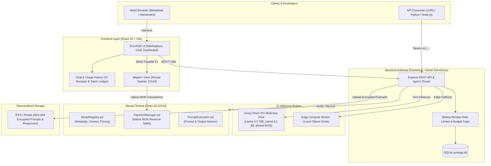
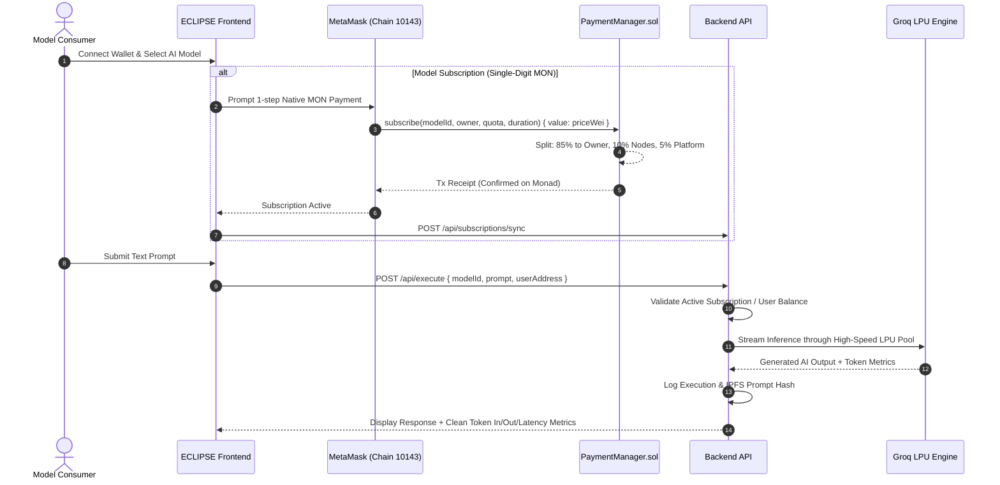
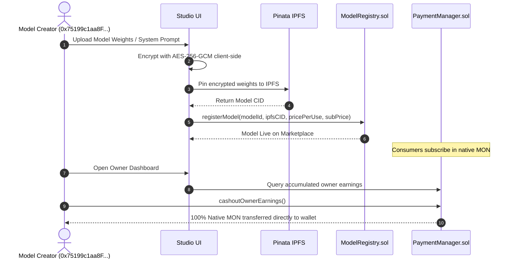

# 🌌 ECLIPSE.AI — Decentralized AI Model Marketplace on Monad

[-836ef9?style=for-the-badge&logo=ethereum)](https://testnet.monadexplorer.com)
[](https://soliditylang.org/)
[](https://groq.com/)
[](https://vitejs.dev/)
[](https://opensource.org/licenses/MIT)

**ECLIPSE.AI** is a decentralized, high-throughput marketplace for AI models deployed on the **Monad Testnet** (10,000 TPS, 1-second finality). It enables AI creators to monetize models trustlessly with AES-256 IPFS encryption, automatic on-chain revenue sharing in native Monad testnet tokens (**MON**), single-digit token pricing, and ultra-fast inference powered by a resilient multi-key **Groq Cloud LPU** pool.

---

## 📑 Table of Contents

- [Live Testnet Deployments](#-live-testnet-deployments)
- [Deep-Dive Documentation](#-deep-dive-documentation)
- [Architectural Overview](#-architectural-overview)
- [System Workflows](#-system-workflows)
  - [1. Model Consumer Journey](#1-model-consumer-journey)
  - [2. Model Owner & Monetization Journey](#2-model-owner--monetization-journey)
  - [3. Developer API & Rate-Limited Access](#3-developer-api--rate-limited-access)
- [Monorepo Directory Structure](#-monorepo-directory-structure)
- [Sub-Module Documentation](#-sub-module-documentation)
- [Quick Start Guide](#-quick-start-guide)
- [Smart Contracts & On-Chain Revenue Model](#-smart-contracts--on-chain-revenue-model)
- [Vercel Deployment Guide](#-vercel-deployment-guide)
- [Security & Verification](#-security--verification)
- [License](#-license)

---

## 🌐 Live Testnet Deployments

ECLIPSE.AI is actively deployed and verified on **Monad Testnet (Chain ID: `10143`)**:

| Contract | Address | Explorer Link |
|:---|:---|:---|
| **`ModelRegistry`** | `0x2f02861ff42c0d04823dadd08326de0b07f57dfe` | [View on Monad Explorer](https://testnet.monadexplorer.com/address/0x2f02861ff42c0d04823dadd08326de0b07f57dfe) |
| **`PaymentManager`** | `0xaa2499494b61d293a437c6bd31ca22b88d8aa9b2` | [View on Monad Explorer](https://testnet.monadexplorer.com/address/0xaa2499494b61d293a437c6bd31ca22b88d8aa9b2) |
| **`PromptExecution`** | `0x70dcf4d82c8e1b989d2a7a3c2303fa48a348d6c1` | [View on Monad Explorer](https://testnet.monadexplorer.com/address/0x70dcf4d82c8e1b989d2a7a3c2303fa48a348d6c1) |
| **Default Model Owner** | `0x75199c1aa8F21Eb583027BbB6763B7c79CC180D6` | [View on Monad Explorer](https://testnet.monadexplorer.com/address/0x75199c1aa8F21Eb583027BbB6763B7c79CC180D6) |

---

## 📚 Deep-Dive Documentation

For comprehensive sub-system specifications, refer to our dedicated guides:

- 🏛️ **[ARCHITECTURE.md](ARCHITECTURE.md)** — Full architectural specifications, state machines, encryption lifecycles, and sequence diagrams.
- 🚀 **[DEPLOYMENT.md](DEPLOYMENT.md)** — Step-by-step Foundry deployment, environment configurations, and Vercel hosting setup.
- 🔌 **[API.md](API.md)** — OpenAI-compatible completions API reference, cURL/Python/Node.js snippets, and rate limit headers.

---

## 🏗️ Architectural Overview



---

## 🔄 System Workflows

### 1. Model Consumer Journey



### 2. Model Owner & Monetization Journey



---

## 📂 Monorepo Directory Structure

```plaintext
monadhacks/
├── backend/                 # Node.js / Express inference gateway & SQLite DB
│   ├── src/
│   │   ├── routes/          # /api/execute, /api/models, /api/user, /api/v1
│   │   ├── services/        # compute.js (Groq failover), encryption.js, blockchain.js
│   │   └── db/              # sqlite.js schema, migrations, seed data
│   └── README.md            # Backend documentation
│
├── frontend/                # React 19 + Vite Web3 application
│   ├── src/
│   │   ├── components/      # Navbar, FaucetModal, CashoutModal, WebGLShader
│   │   ├── pages/           # Marketplace, ModelDetail, ChatHistory, Dashboard, Owner
│   │   └── contracts/       # Contract addresses & Foundry ABIs
│   └── README.md            # Frontend documentation
│
├── src/                     # Solidity smart contracts (Foundry)
│   ├── ModelRegistry.sol    # Model registry & pricing catalog
│   ├── PaymentManager.sol   # Native MON revenue router (85/10/5 split)
│   ├── PromptExecution.sol  # Verifiable execution ledger
│   └── README.md            # Foundry contracts documentation
│
├── compute-node/            # Edge worker for decentralized Ollama inference
│   └── README.md            # Compute node documentation
│
├── ARCHITECTURE.md          # End-to-end technical specifications
├── DEPLOYMENT.md            # Deployment & operations runbook
├── API.md                   # Developer REST API & OpenAI completions reference
└── README.md                # Root project overview
```

---

## 🚀 Quick Start Guide

### Prerequisites
- **Node.js**: v18.0.0 or higher ([Download](https://nodejs.org/))
- **Foundry**: For smart contract compilation and deployment ([Install Foundry](https://getfoundry.sh/))
- **Web3 Wallet**: [MetaMask](https://metamask.io/) or Rainbow Wallet configured with **Monad Testnet**

### 1. Clone & Configure Environment
```bash
git clone https://github.com/Arpit-R-Doshi/monadhacks.git
cd monadhacks
cp .env.example .env
```

### 2. Start the Backend Engine
```bash
cd backend
npm install
npm run dev
# Health check: curl http://localhost:3001/api/health
```

### 3. Launch the Frontend UI
```bash
cd ../frontend
npm install
npm run dev
```
Open [http://localhost:5173](http://localhost:5173) in your browser. Connect MetaMask to **Monad Testnet** (`10143`).

---

## 🔐 Smart Contracts & On-Chain Revenue Model

All transactions, subscriptions, and withdrawals operate **strictly in native Monad testnet tokens (`MON`)**:

| Contract | Functionality | Revenue Split / Mechanism |
|:---|:---|:---|
| **`PaymentManager.sol`** | Native `payable` router for inference & subscriptions | **85%** directly to Model Owner<br>**10%** to Compute Node Workers<br>**5%** to Platform Treasury |
| **`ModelRegistry.sol`** | Immutable model registry | Stores encrypted model IPFS CIDs, ownership proof, and pricing metadata |
| **`PromptExecution.sol`** | Cryptographic verification | Tracks prompt lifecycle hashes on-chain for tamper-proof audit trails |

---

## 🛡️ Security & Verification

- **Pure Confidential Computing**: Model prompts are encrypted using **AES-256-GCM** before being pinned to IPFS.
- **Audited Solidity Patterns**: Inherits standard OpenZeppelin `Ownable` and `ReentrancyGuard` implementations.
- **Decentralized Verifiability**: Dedicated **Usage & Purchase History** ledger lets users audit all on-chain transactions on Monad Explorer.

---

## 📜 License

This project is licensed under the **MIT License**. See the [LICENSE](LICENSE) file for details.
