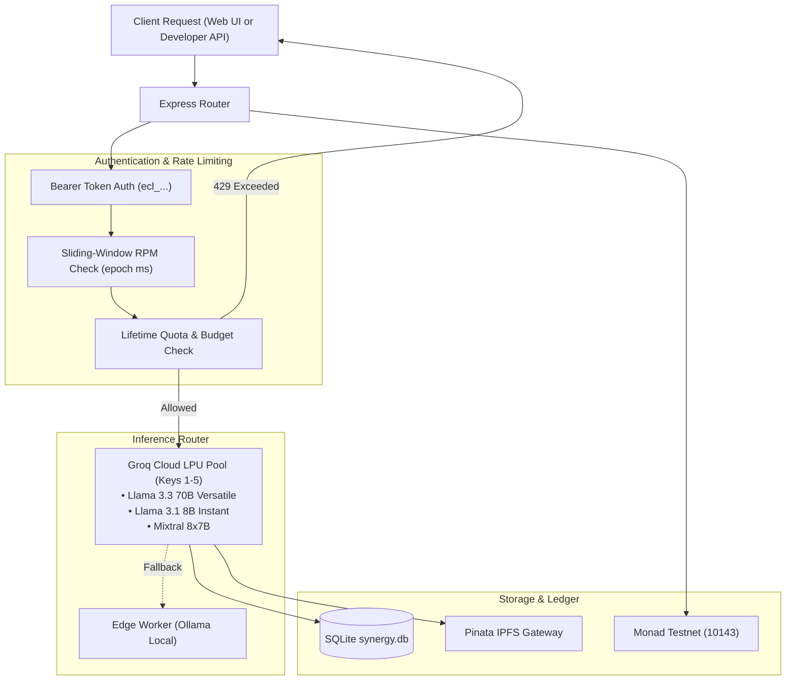

# ⚙️ ECLIPSE.AI Backend Service

The backend is an enterprise-grade REST and inference gateway written in **Node.js (Express)**. It powers live AI inference via a resilient **Groq Cloud LPU** multi-key pool, enforces sliding-window API rate limits and spend caps in **SQLite**, and integrates directly with the **Monad Testnet** for on-chain verification.

---

## 📑 Table of Contents

- [Core Features](#-core-features)
- [Architecture & Data Flow](#-architecture--data-flow)
- [Database Schema (SQLite)](#-database-schema-sqlite)
- [API Rate Limiting & Usage Caps](#-api-rate-limiting--usage-caps)
- [Groq Multi-Key Failover Engine](#-groq-multi-key-failover-engine)
- [API Endpoints Reference](#-api-endpoints-reference)
  - [1. Inference & OpenAI-Compatible Completions](#1-inference--openai-compatible-completions)
  - [2. User History & Audit Ledger](#2-user-history--audit-ledger)
  - [3. Owner MON Cashout](#3-owner-mon-cashout)
  - [4. API Key Management](#4-api-key-management)
  - [5. Models & Metadata](#5-models--metadata)
  - [6. System Health & Nodes](#6-system-health--nodes)
- [Local Development & Testing](#-local-development--testing)
- [Serverless / Vercel Execution](#-serverless--vercel-execution)

---

## ✨ Core Features

- **OpenAI-Compatible Chat Completions**: Standard `/api/v1/chat/completions` endpoint for plug-and-play integration with LangChain, LlamaIndex, cURL, and Python scripts.
- **Groq LPU Multi-Key Pool**: Round-robin key rotation with instant failover across 5 secondary keys if rate limits (HTTP 429) are encountered.
- **Sliding-Window Rate Limiting**: Precision millisecond tracking in SQLite enforcing custom Requests Per Minute (15, 30, 60, 120, 300 RPM).
- **Budget & Usage Caps**: Developer-defined lifetime request limits and native MON spend caps.
- **On-Chain Audit Ledger**: Full history tracking for purchases, executed prompts, token metrics, and Monad Explorer transaction links.
- **Native MON Revenue Routing**: Direct integration with `PaymentManager.sol` for 85/10/5 revenue splits and 100% native MON creator withdrawals.

---

## 🏛️ Architecture & Data Flow



---

## 🗄️ Database Schema (SQLite)

The backend uses SQLite (`backend/synergy.db` locally, or `/tmp/synergy.db` on Vercel):

### `api_keys` Table
| Column | Type | Description |
|--------|------|-------------|
| `id` | TEXT PRIMARY KEY | Formatted API Key (`ecl_...`) |
| `wallet_address` | TEXT | Creator wallet address |
| `name` | TEXT | Friendly name (e.g. `Production Bot`) |
| `rate_limit_rpm` | INTEGER | Requests per minute limit (default: 60) |
| `usage_limit_requests` | INTEGER | Max allowed requests (0 = unlimited) |
| `usage_limit_mon` | REAL | Max allowed MON spend (0 = unlimited) |
| `total_spent_mon` | REAL | Accumulated spend in MON |
| `total_requests` | INTEGER | Total requests consumed |
| `is_active` | INTEGER | Key status (1 = active, 0 = revoked) |
| `created_at` | TIMESTAMP | Creation timestamp |

### `prompts` Table
| Column | Type | Description |
|--------|------|-------------|
| `id` | TEXT PRIMARY KEY | Unique prompt execution ID |
| `model_id` | TEXT | Foreign key to `models(id)` |
| `user_address` | TEXT | Caller wallet address |
| `session_id` | TEXT | Chat conversation session ID |
| `prompt_text` | TEXT | Plaintext prompt for user history |
| `encrypted_prompt_cid`| TEXT | Encrypted prompt IPFS CID |
| `response_text` | TEXT | Plaintext response |
| `encrypted_response_cid`| TEXT | Encrypted response IPFS CID |
| `input_tokens` | INTEGER | Estimated/counted input tokens |
| `output_tokens` | INTEGER | Counted completion tokens |
| `duration_ms` | INTEGER | Execution time in milliseconds |
| `tx_hash` | TEXT | Monad on-chain proof transaction hash |

---

## 🚦 API Rate Limiting & Usage Caps

Every request to `/api/v1/chat/completions` is audited in real-time:

1. **Sliding-Window Audit**: Counts requests timestamped within `[Now - 60000ms, Now]`.
2. **Quota Check**: Verifies `total_requests < usage_limit_requests`.
3. **Spend Check**: Verifies `total_spent_mon < usage_limit_mon`.

If any limit is violated, the gateway returns HTTP `429 Too Many Requests` along with a `Retry-After` header.

---

## ⚡ Groq Multi-Key Failover Engine

Configured via environment variables:
- `GROQ_API_KEY`: Primary key
- `GROQ_API_KEY_1` through `GROQ_API_KEY_4`: Secondary keys

If an inference request receives an HTTP 429 or rate limit notice from Groq, the engine automatically selects the next key in the pool and immediately retries the request without failing client execution.

---

## 📡 API Endpoints Reference

### 1. Inference & Completions
- `POST /api/execute`: Core prompt execution pipeline (subscription verification -> encryption -> IPFS -> compute -> ledger commit).
- `POST /api/v1/chat/completions`: OpenAI-compatible completions endpoint.

### 2. User History & Audit Ledger
- `GET /api/user/purchases?wallet=0x...`: Returns user subscriptions with on-chain tx hashes.
- `GET /api/user/prompts?wallet=0x...`: Returns prompt execution and token consumption ledger.
- `GET /api/user/sessions?wallet=0x...`: Returns user chat sessions for historical conversation playback.

### 3. Owner MON Cashout
- `POST /api/user/cashout`: Executes model creator withdrawal strictly in native Monad tokens (`MON`).

### 4. API Key Management
- `GET /api/keys?wallet=0x...`: Lists all API keys owned by wallet.
- `POST /api/keys`: Generates new key with RPM and spend caps.
- `DELETE /api/keys/:id`: Revokes an API key.

### 5. Models & Metadata
- `GET /api/models`: Returns verified marketplace models.
- `GET /api/models/:id`: Returns detailed specs, encryption keys, and pricing.

### 6. System Health & Nodes
- `GET /api/health`: Node status, Monad RPC connectivity, and database health.
- `GET /api/compute/nodes`: Active Groq and edge compute nodes.

---

## 🛠️ Local Development & Testing

```bash
cd backend
npm install
npm run dev
```

Run manual health check:
```bash
curl http://localhost:3001/api/health
```

Seed database:
```bash
curl http://localhost:3001/api/seed
```
