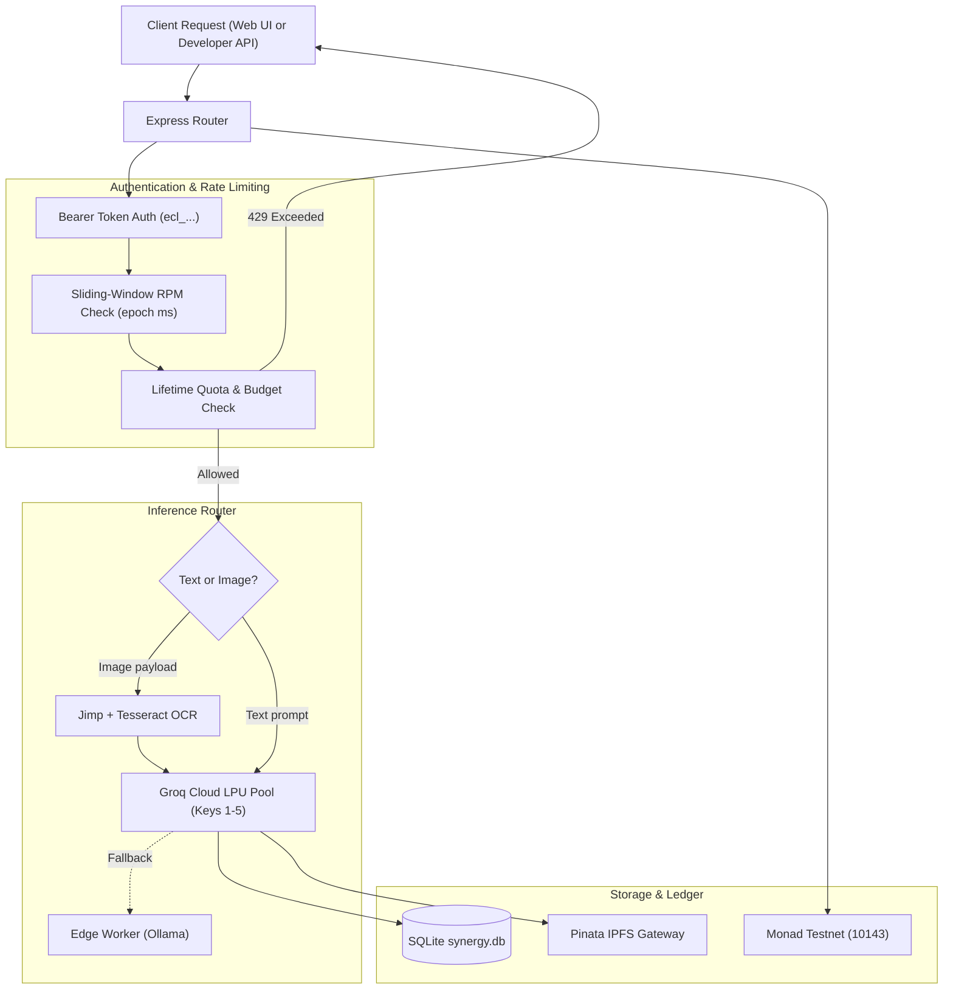

# ⚙️ ECLIPSE.AI Backend Service

The backend is an enterprise-grade REST and inference gateway written in **Node.js (Express)**. It powers live AI inference via a resilient **Groq Cloud LPU** multi-key pool, enforces sliding-window API rate limits and spend caps in **SQLite**, and integrates directly with the **Monad Testnet** for on-chain verification.

---

## 📑 Table of Contents

- [Core Features](#-core-features)
- [Architecture & Data Flow](#-architecture--data-flow)
- [Database Schema (SQLite)](#-database-schema-sqlite)
- [API Rate Limiting & Usage Caps](#-api-rate-limiting--usage-caps)
- [Groq Multi-Key Failover Engine](#-groq-multi-key-failover-engine)
- [API Endpoints Reference](#-api-endpoints-reference)
  - [1. Inference & OpenAI-Compatible Completions](#1-inference--openai-compatible-completions)
  - [2. API Key Management](#2-api-key-management)
  - [3. Models & Metadata](#3-models--metadata)
  - [4. Subscriptions & Payments](#4-subscriptions--payments)
  - [5. System Health & Configuration](#5-system-health--configuration)
- [Local Development & Testing](#-local-development--testing)
- [Serverless / Vercel Execution](#-serverless--vercel-execution)

---

## ✨ Core Features

- **OpenAI-Compatible Chat Completions**: Standard `/api/v1/chat/completions` endpoint for plug-and-play integration with LangChain, LlamaIndex, cURL, and Python scripts.
- **Groq LPU Multi-Key Pool**: Round-robin key rotation with instant failover to secondary keys if rate limits (HTTP 429) are encountered.
- **Sliding-Window Rate Limiting**: Precision millisecond tracking in SQLite enforcing custom Requests Per Minute (15, 30, 60, 120, 300 RPM).
- **Budget & Usage Caps**: Developer-defined lifetime request limits and native MON spend caps.
- **Computer Vision OCR**: Integrated Jimp preprocessing and Tesseract OCR for parsing images passed in multimodal requests.
- **Monad Testnet Service**: Ethers.js integration for reading native MON balances, querying smart contract state, and signing transactions.

---

## 🏛️ Architecture & Data Flow



---

## 🗄️ Database Schema (SQLite)

The backend uses SQLite (`backend/synergy.db` locally, or `/tmp/synergy.db` on Vercel):

### `api_keys` Table
| Column | Type | Description |
|--------|------|-------------|
| `id` | TEXT PRIMARY KEY | Formatted API Key (`ecl_...`) |
| `wallet_address` | TEXT | Creator wallet address |
| `name` | TEXT | Friendly name (e.g. `Production Bot`) |
| `rate_limit_rpm` | INTEGER | Requests per minute limit (default: 60) |
| `usage_limit_requests` | INTEGER | Max allowed requests (0 = unlimited) |
| `usage_limit_mon` | REAL | Max allowed MON spend (0 = unlimited) |
| `total_spent_mon` | REAL | Accumulated spend in MON |
| `total_requests` | INTEGER | Total requests consumed |
| `is_active` | INTEGER | Key status (1 = active, 0 = revoked) |
| `created_at` | TIMESTAMP | Creation timestamp |

### `api_key_rate_limits` Table
| Column | Type | Description |
|--------|------|-------------|
| `id` | INTEGER PRIMARY KEY | Autoincrement ID |
| `key_id` | TEXT | Foreign key to `api_keys(id)` |
| `timestamp_ms` | INTEGER | Request epoch timestamp in milliseconds |

### `models` Table
| Column | Type | Description |
|--------|------|-------------|
| `id` | TEXT PRIMARY KEY | Model identifier (e.g. `llama-3.3-70b`) |
| `name` | TEXT | Display name |
| `description` | TEXT | Model overview and capabilities |
| `ipfs_cid` | TEXT | IPFS CID containing encrypted model weights |
| `owner_address` | TEXT | Model creator wallet address |
| `price_per_use` | REAL | API cost per call in MON |
| `subscription_price` | REAL | Monthly subscription in MON |

---

## 🚦 API Rate Limiting & Usage Caps

Every request to `/api/v1/chat/completions` is audited in real-time:

1. **Sliding-Window RPM**:
   ```sql
   -- Counts requests within the last 60,000 milliseconds
   SELECT COUNT(*) as count FROM api_key_rate_limits 
   WHERE key_id = ? AND timestamp_ms > ?;
   ```
2. **Response Headers**:
   ```http
   X-RateLimit-Limit: 60
   X-RateLimit-Remaining: 59
   X-RateLimit-Reset: 1726738920
   ```
3. **Rejection Response (HTTP 429)**:
   ```json
   {
     "error": {
       "message": "Rate limit exceeded. Your key is limited to 60 requests per minute.",
       "type": "rate_limit_error",
       "code": "rate_limit_exceeded"
     }
   }
   ```

---

## ⚡ Groq Multi-Key Failover Engine

Configured in `backend/src/services/compute.js`:
- Supports up to 5 concurrent Groq API keys (`GROQ_API_KEY`, `GROQ_API_KEY_1`... `GROQ_API_KEY_5`).
- Keys rotate automatically per request to distribute load across Groq LPU quotas.
- If any key receives an `HTTP 429` from Groq, the engine marks the key as exhausted and immediately retries the prompt on the next available key with 0 dropped requests.

---

## 📡 API Endpoints Reference

### 1. Inference & OpenAI-Compatible Completions

#### `POST /api/v1/chat/completions`
Standard endpoint for developer integration.

**Headers**:
```http
Authorization: Bearer ecl_your_key_here
Content-Type: application/json
```

**Request Body**:
```json
{
  "model": "llama-3.1-8b",
  "messages": [
    { "role": "user", "content": "Explain quantum computing in one sentence." }
  ]
}
```

**Multimodal Vision Request Body**:
```json
{
  "model": "llama-3.3-70b",
  "messages": [
    {
      "role": "user",
      "content": [
        { "type": "text", "text": "What is written in this screenshot?" },
        { "type": "image_url", "image_url": { "url": "data:image/png;base64,..." } }
      ]
    }
  ]
}
```

---

### 2. API Key Management

- `GET /api/keys/:walletAddress`: List all API keys, usage statistics, and active caps.
- `POST /api/keys/generate`: Generate a new API key with custom RPM and budget limits.
- `POST /api/keys/revoke`: Revoke an active API key.

---

### 3. Models & Metadata

- `GET /api/models`: List all marketplace models.
- `GET /api/models/:id`: Retrieve detailed metadata, pricing, and owner address.
- `POST /api/models`: Register a new model with its IPFS CID.

---

### 4. Subscriptions & Payments

- `GET /api/subscriptions/check/:wallet/:modelId`: Check if a wallet has an active on-chain subscription.
- `POST /api/subscriptions/sync`: Synchronize an on-chain `subscribe()` transaction into the SQLite read-cache.
- `POST /api/wallet/faucet`: Instant testnet faucet claim (credits 10 MON).

---

### 5. System Health & Configuration

- `GET /api/health`: Comprehensive status check of Database, Blockchain RPC, IPFS, and Groq engine.
- `GET /api/config`: Returns active Monad Testnet configuration and smart contract ABIs for the frontend.

---

## 🧪 Local Development & Testing

```bash
cd backend
npm install
npm run dev
```

To run a quick health check:
```bash
curl http://localhost:3001/api/health
```

---

## ☁️ Serverless / Vercel Execution

In Vercel serverless environments (`process.env.VERCEL === '1'`):
- The server does not invoke `app.listen()`. Instead, `api/index.js` exports the app handler.
- The SQLite database automatically copies `backend/synergy.db` to `/tmp/synergy.db` (the only writable directory in Vercel Lambdas) upon initialization.
