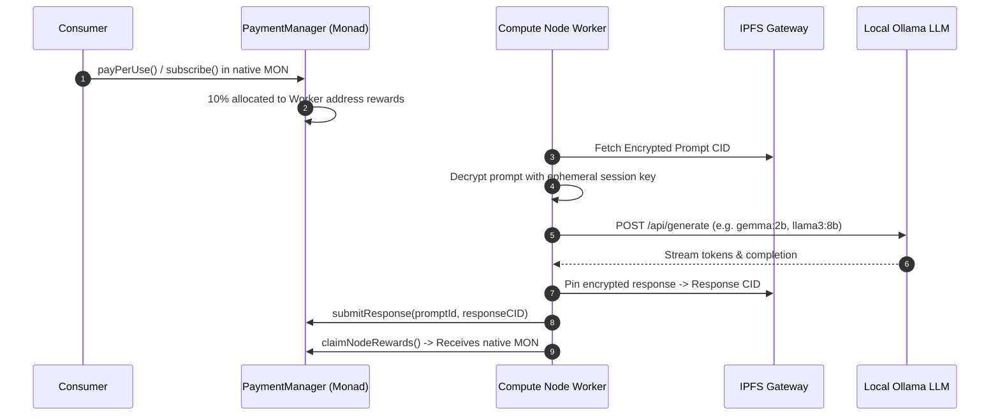

# 🖥️ ECLIPSE.AI Compute Node Worker

The compute node worker enables decentralized machines to participate in the ECLIPSE network, run local edge inference (via Ollama or local LLMs), and earn **10% of all platform transaction revenue in native Monad testnet tokens (`MON`)**.

---

## 📑 Table of Contents

- [Overview](#-overview)
- [Compute Worker Lifecycle](#-compute-worker-lifecycle)
- [Reward Mechanism (10% MON Split)](#-reward-mechanism-10-mon-split)
- [Prerequisites](#-prerequisites)
- [Configuration & Setup](#-configuration--setup)
- [Running the Worker](#-running-the-worker)

---

## 🔍 Overview

In the ECLIPSE.AI architecture, inference requests can be routed to either:
1. **Groq Cloud LPU Engine** (Default cloud ultra-fast path, 500+ T/s)
2. **Decentralized Compute Worker Nodes** (Edge worker path running local open weights on Ollama)

Compute nodes provide censorship-resistant, decentralized execution. Model prompts are fetched encrypted from IPFS, decrypted locally in a secure enclave/runtime, executed, and the resulting response hash is committed back to the Monad blockchain.

---

## 🔄 Compute Worker Lifecycle



---

## 💰 Reward Mechanism (10% MON Split)

Every pay-per-use and subscription transaction routed through `PaymentManager.sol` automatically dedicates:
- **85%** to the Model Owner
- **10%** to the Compute Node address (`nodeRewards[computeNode]`)
- **5%** to Platform Treasury

Node operators can query and claim their accumulated rewards on-chain at any time by calling `claimNodeRewards()` on `PaymentManager.sol`.

---

## 📋 Prerequisites

1. **Node.js**: v18+
2. **Ollama**: Installed and running locally ([Install Ollama](https://ollama.com/))
   ```bash
   ollama pull gemma:2b
   ollama pull llama3:8b
   ollama serve
   ```
3. **Monad Testnet Wallet**: An address funded with testnet `MON` for gas.

---

## ⚙️ Configuration & Setup

Create a `.env` file inside `compute-node/`:
```env
BACKEND_URL=http://localhost:3001
OLLAMA_URL=http://localhost:11434
NODE_ADDRESS=0xYourComputeNodeWalletAddress
```

Install dependencies:
```bash
cd compute-node
npm install
```

---

## 🚀 Running the Worker

Start the worker process:
```bash
npm start
```

The worker will:
1. Ping your local Ollama instance on `http://localhost:11434`.
2. Verify available downloaded models (`gemma:2b`, `llama3:8b`).
3. Connect to the ECLIPSE network and begin listening for scheduled inference jobs.
