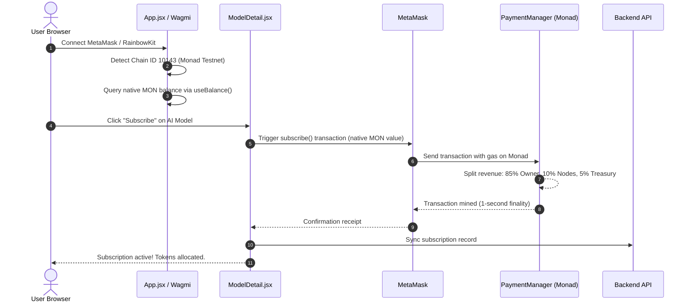

# 💻 ECLIPSE.AI Frontend Application

The frontend is a modern, high-performance Web3 single-page application built with **React 19**, **Vite**, **Tailwind/Vanilla CSS**, **Framer Motion**, and **Wagmi / Viem / RainbowKit** connected directly to the **Monad Testnet** (Chain ID: `10143`).

---

## 📑 Table of Contents

- [Features](#-features)
- [Component & Page Hierarchy](#-component--page-hierarchy)
- [Page Overview](#-page-overview)
- [Web3 & Smart Contract Interaction Flow](#-web3--smart-contract-interaction-flow)
- [Local Development Setup](#-local-development-setup)
- [Building for Production](#-building-for-production)
- [Vercel Deployment Details](#-vercel-deployment-details)

---

## ✨ Features

- **Interactive WebGL Hero**: Custom fragment shader rendering interactive particle motion on the landing page.
- **Seamless Wallet Integration**: Powered by RainbowKit & Wagmi with auto-switching to Monad Testnet (`10143`).
- **Live On-Chain Balance**: Real-time display of native `MON` balances using Wagmi's reactive hooks.
- **1-Click Testnet Faucet Modal**: Direct link to official Monad testnet faucet, instantaneous 10 MON backend claim, and MetaMask network adder.
- **Real-Time AI Inference Chat**: Interactive prompt runner with markdown rendering, execution latency metrics, and clean message bubbles.
- **Dedicated Usage & Purchase History**: Multi-tab history center (`ChatHistory.jsx`) tracking model purchase receipts, prompt token consumption, on-chain tx hashes, and past chat sessions.
- **Developer API Dashboard**: Generate and manage scoped API keys (`ecl_...`) with configurable sliding-window RPM (15 to 300 RPM), max request caps, and MON spend caps.
- **Model Creator Studio**: Client-side AES-256 encryption for model weights with automated IPFS upload via Pinata and 100% native MON cashout.

---

## 🏛️ Component & Page Hierarchy

```plaintext
frontend/src/
├── App.jsx                  # Main application wrapper, AppContext provider, Router
├── main.jsx                 # RainbowKit, WagmiConfig & Monad Testnet setup
├── index.css                # Global design system & theme variables
├── components/
│   ├── Navbar.jsx           # Top navigation, role switcher, live MON balance badge
│   ├── FaucetModal.jsx      # Monad testnet faucet modal & network adder
│   ├── CashoutModal.jsx     # Model owner earnings withdrawal interface (MON only)
│   └── WebGLShader.jsx      # Interactive canvas shader background for hero section
└── pages/
    ├── Landing.jsx          # Public showcase, feature highlights, and animated stats
    ├── RoleSelect.jsx       # Persona selector: Model Consumer vs Model Owner
    ├── Marketplace.jsx      # Model catalog with filtering, search, and pricing
    ├── ModelDetail.jsx      # Inference chat room, token stats, and on-chain subscribe
    ├── ChatHistory.jsx      # Chat sessions, token usage ledger, and purchase receipts
    ├── Dashboard.jsx        # Developer portal: API keys, usage metrics, limits, quickstart
    ├── OwnerDashboard.jsx   # Model creator portal: registered models, stats, cashout
    └── UploadModel.jsx      # 3-step wizard for AES-256 encryption & model registration
```

---

## 🖥️ Page Overview

### 1. `Landing.jsx`
The entrance to the marketplace featuring an interactive WebGL canvas background shader. Outlines key benefits of Monad Testnet (10,000 TPS, sub-second latency, zero gas griefing).

### 2. `Marketplace.jsx`
Browse verified AI models (e.g. Llama 3.3 70B, Llama 3.1 8B, Mixtral 8x7B) with single-digit pricing in native **MON**, rate limits, category filters, and latency badges.

### 3. `ModelDetail.jsx`
The core interactive inference workspace:
- Check subscription status or test free demo prompts.
- **1-Step Subscription**: Directly pay in native MON without approval steps.
- **Streamlined Chat**: Fast text inference with token counters (`📥 in`, `📤 out`), execution latency (`⏱️`), and auto-scrolling message streams.
- **Compute Node Selector**: Switch between Groq Cloud LPU or Edge Compute Worker.

### 4. `ChatHistory.jsx`
The full decentralized audit and history suite featuring three distinct views:
- **Tab 1: Purchases & Subscriptions**: View active and historical subscriptions, prices paid in MON, quota allocated, and verifiable on-chain Monad Explorer transaction links.
- **Tab 2: Prompt & Token Usage**: Granular ledger of all executed prompts, input/output tokens consumed, compute node used, duration, and execution hashes.
- **Tab 3: Chat Sessions**: Re-open and review complete conversation threads grouped by session ID.

### 5. `Dashboard.jsx`
Developer management suite:
- Generate scoped API keys (`ecl_...`).
- Set rate limits: `15`, `30`, `60`, `120`, or `300` Requests Per Minute.
- Set lifetime request caps (e.g. 500 requests) or budget caps (e.g. 25 MON).
- Copy instant cURL, Python, and Node.js quickstart code.

### 6. `OwnerDashboard.jsx`
Model creator revenue portal:
- View all models registered under the connected wallet.
- Monitor total usage and accumulated earnings.
- **1-Click Cashout**: Withdraw earnings directly in native **MON** via `PaymentManager.sol`.

---

## 🔗 Web3 & Smart Contract Interaction Flow



---

## 🛠️ Local Development Setup

```bash
cd frontend
npm install
npm run dev
```
The application will launch on [http://localhost:5173](http://localhost:5173).

---

## 📦 Building for Production

```bash
npm run build
```
Build output is saved to `frontend/dist`.

---

## ☁️ Vercel Deployment Details

Vercel reads configuration from root `vercel.json`:
- **Framework**: Vite
- **Build Command**: `cd frontend && npm install && npm run build`
- **Output Directory**: `frontend/dist`
- **Environment Variables**: Make sure to set `VITE_API_URL` to your production backend URL or leave empty for same-origin proxying.
