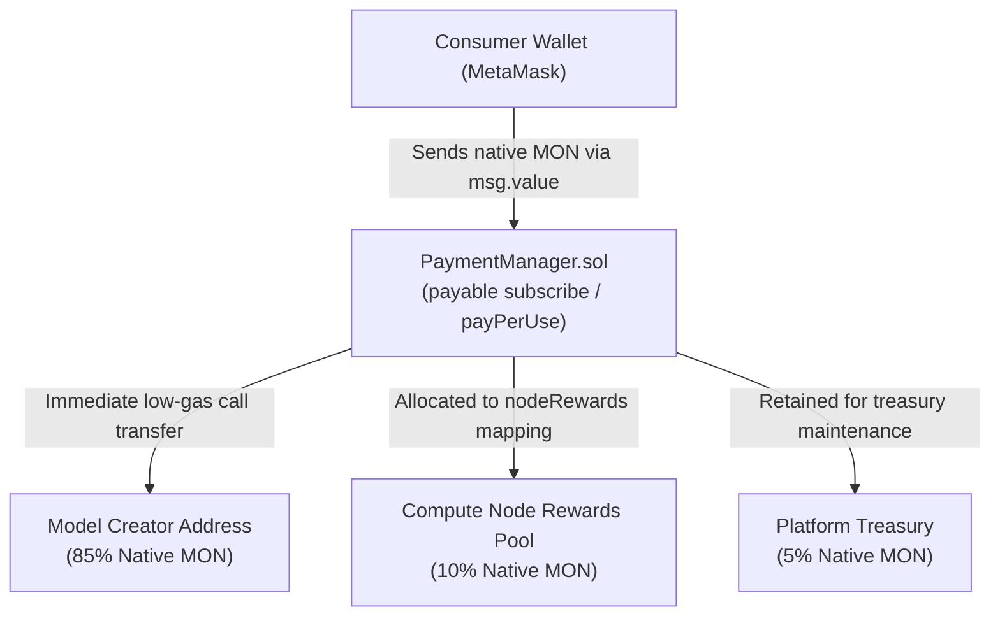

# 🔐 ECLIPSE.AI Smart Contracts (Foundry)

The smart contracts layer manages decentralized model registration, tamper-proof execution verification, and native payment distribution on the **Monad Testnet** (Chain ID: `10143`).

Built with **Solidity 0.8.20** and compiled/deployed using **Foundry**.

---

## 📑 Table of Contents

- [Contract Specifications](#-contract-specifications)
- [On-Chain Revenue Split Flow](#-on-chain-revenue-split-flow)
- [Contract Interfaces](#-contract-interfaces)
  - [1. `PaymentManager.sol`](#1-paymentmanagersol)
  - [2. `ModelRegistry.sol`](#2-modelregistrysol)
  - [3. `PromptExecution.sol`](#3-promptexecutionsol)
- [Monad Testnet Configuration](#-monad-testnet-configuration)
- [Compilation & Testing](#-compilation--testing)
- [Deployment Guide](#-deployment-guide)

---

## 📜 Contract Specifications

| Contract | Purpose | State Variables / Key Features |
|----------|---------|--------------------------------|
| **`PaymentManager.sol`** | Native `MON` revenue router | Splits 85% to model owner, 10% to compute nodes, and 5% to platform treasury via native `msg.value` |
| **`ModelRegistry.sol`** | Decentralized model catalog | Maps `modelId` to IPFS CIDs, owner addresses, and pricing metadata |
| **`PromptExecution.sol`** | Verifiable execution ledger | Emits on-chain proofs linking encrypted prompt IPFS CIDs to model inference output CIDs |

---

## 💰 On-Chain Revenue Split Flow



### Key Highlights:
1. **Zero ERC-20 Approvals Needed**: Because payments are in native `MON`, users only sign a single transaction to subscribe or execute models.
2. **Atomic Payouts**: 85% of payment is transferred directly to the model creator's wallet within the same block transaction.

---

## 💻 Contract Interfaces

### 1. `PaymentManager.sol`

Handles pay-per-use and monthly subscription payments in native `MON`:

```solidity
// Direct subscription with 85/10/5 native MON split
function subscribe(
    string calldata _modelId,
    address _modelOwner,
    uint256 _quota,
    uint256 _duration
) external payable;

// Per-use payment for on-demand inference
function payPerUse(
    string calldata _modelId,
    address _modelOwner,
    address _computeNode
) external payable;

// Compute nodes claim accumulated rewards
function claimNodeRewards() external;
```

---

### 2. `ModelRegistry.sol`

Maintains immutable registry of model metadata and IPFS encrypted weight hashes:

```solidity
function registerModel(
    bytes32 _modelId,
    string calldata _ipfsCID,
    uint256 _pricePerUse,
    uint256 _subscriptionPrice
) external;

function getModel(bytes32 _modelId) external view returns (Model memory);
```

---

### 3. `PromptExecution.sol`

Records prompt hashes and verifies AI execution on-chain:

```solidity
function createPrompt(
    bytes32 _promptId,
    bytes32 _modelId,
    string calldata _encryptedPromptCID
) external;

function submitResponse(
    bytes32 _promptId,
    string calldata _responseCID,
    bytes32 _responseHash
) external;
```

---

## 🌐 Monad Testnet Configuration

Foundry is configured in `foundry.toml` with Monad's high-speed RPC:

| Parameter | Value |
|-----------|-------|
| **Network** | Monad Testnet |
| **Chain ID** | `10143` (`0x279f`) |
| **RPC URL** | `https://testnet-rpc.monad.xyz/` |
| **Block Explorer** | `https://testnet.monadexplorer.com` |
| **Official Faucet** | `https://testnet.monad.xyz/` |
| **Solidity Version**| `0.8.20` |

---

## 🔨 Compilation & Testing

Compile smart contracts using Foundry:
```bash
# From repository root
forge build
```

Clean build cache if needed:
```bash
forge clean && forge build
```

---

## 🚀 Deployment Guide

### 1. Fund Your Deployer Wallet
Ensure your deployer address has testnet `MON` using the [Monad Testnet Faucet](https://testnet.monad.xyz/).

### 2. Run the Deployment Script
```bash
forge script script/Deploy.s.sol \
  --rpc-url https://testnet-rpc.monad.xyz/ \
  --broadcast \
  --private-key $DEPLOYER_PRIVATE_KEY
```

### 3. Copy Deployed Addresses
The script prints the deployed addresses:
```plaintext
=== Deployment on Monad Complete ===
Model Registry:   0x...
Payment Manager:  0x...
Prompt Execution: 0x...
Deployer:         0x...
```
Update these values in [.env](file:///Users/arpitdoshi/monadhacks/.env) under:
- `MODEL_REGISTRY_ADDRESS`
- `PAYMENT_MANAGER_ADDRESS`
- `PROMPT_EXECUTION_ADDRESS`
